# Empire
in this write up i will share how i solved Empire machine from Icex64 on vulnhub, which can be found [here]('https://www.vulnhub.com/entry/empire-lupinone,750/')

## Information Gathering & Enumeration
   * at first i started by doing host discovery on my network by using nmap
     ```sh 
        nmap -sn 192.168.1.1/24
     ```
  and i came up with this result: 
  <div>
    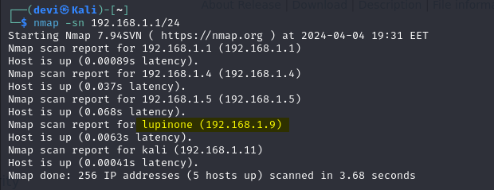
  </div>
<br>

* After identifying the target machine, our next step is to conduct a port scan. This process allows us to discover the active ports and services running on the target system. By doing so, we aim to uncover any potential outdated services or vulnerabilities that could be exploited. 
  and for that i used the following command:
  ```bash
  sudo nmap -sV -sS -Pn -T5 192.168.1.1/24
  ```
   <div>
    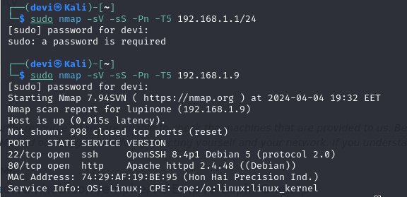
  </div>
<br>

`
we found port 80 for http and 22 for ssh are open, port 80 means there is a website hosted on this machine and ssh simply is a protocol used for remote accessing other systems but with a username and Password or with a Private-Key. 
`
<br>
  * let  us go to the website and see what could be found.
  
<div>
    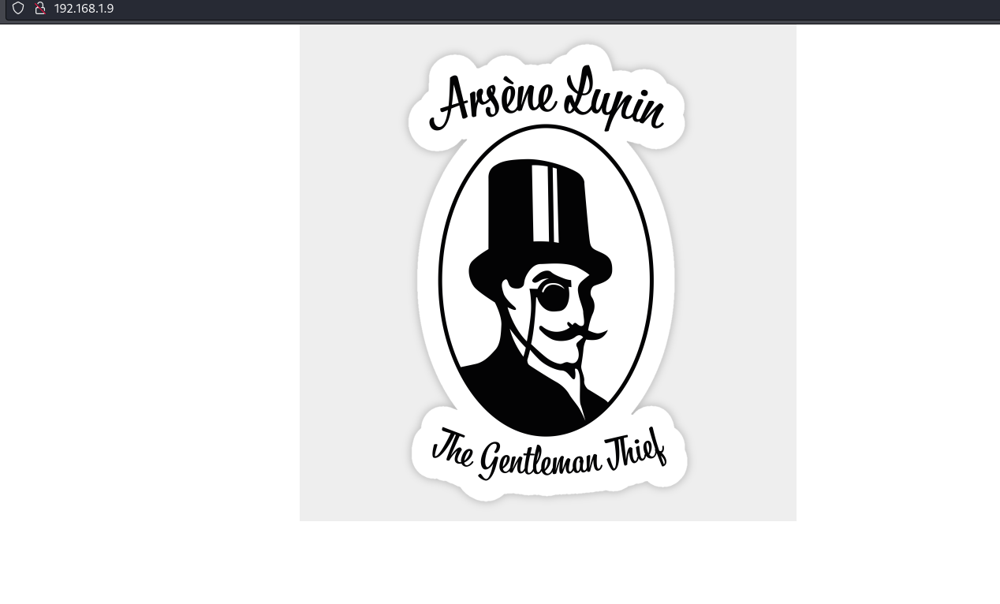
  </div>
<br>

* just a photo with nothing else on the site, so our next step is to do a directory brute forcing, Which can be done with many tools such as diresearch,Ffuf,dirbuster and more, for the sack of this machine i used dirsearch and ffuf.
 ```bash
  dirsearch -u http://192.168.1.9/ 
  ```
<br>

 <div>
    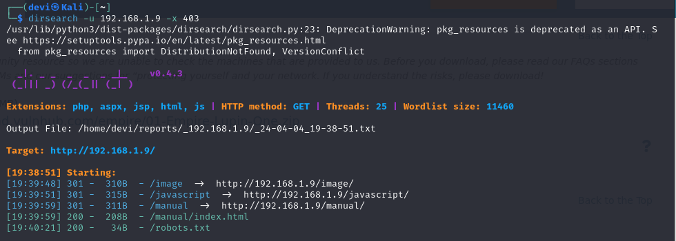
  </div>
<br>

* we found some end points on the site,let us navigate into robots.txt file which could lead us to unleash more end points or secret keys.
   <br>

  <div>
    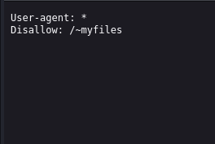
  </div>
<br>

* we found another end point named `~myfiles` so let's see what is in there.
  
    <br>

  <div>
    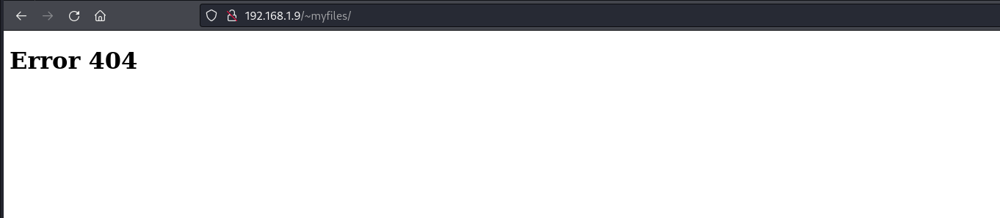
  </div>
<br>
  <br>

  <div>
    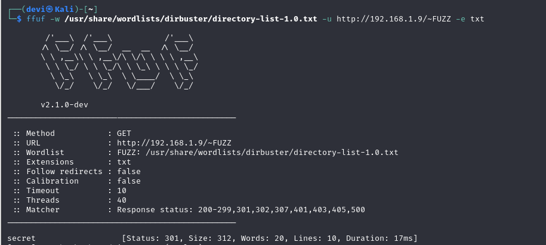
  </div>
<br>
  
  * by using ffuf to enumerate more files we found `~secret`.

<br>

  <div>
    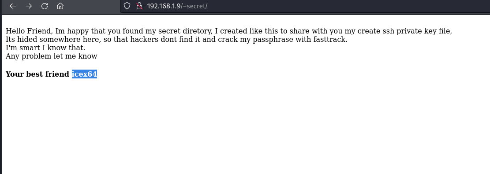
  </div>
<br>

* it's a message that tells us that there is another hidden directory which contains a ssh private key, so we have to do more Directory-Brute forcing, so i used ffuf for doing that but notice it's a hidden file or directory so we should embed a '.' before our fuzzing point as the following command:  
  ```bash
  ffuf -w /usr/share/wordlists/dirbuster/directory-list-2.3-medium.txt -u http://192.168.1.9/~secret/.FUZZ -e .txt -fc 403
  ```
     <br>

  <div>
    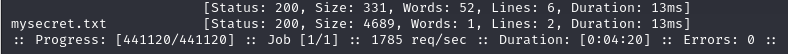
  </div>
<br>

* we got a file that has the name `.mysecret.txt` let us open it and see what could be found.
  
     <br>

  <div>
    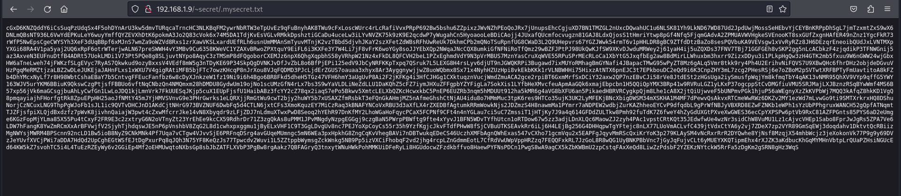
  </div>
<br>

* it's an encoded cypher maybe base64 or base32 we will see, to decode this cypher i used CyberChef and after some trial and error i found that it's an base58 


  <br>

  <div>
    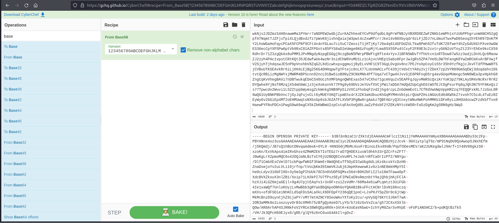
  </div>
<br>

* at this point i copied the decoded ssh private key and saved it in a file named `rsa`.
   
     <br>

  <div>
    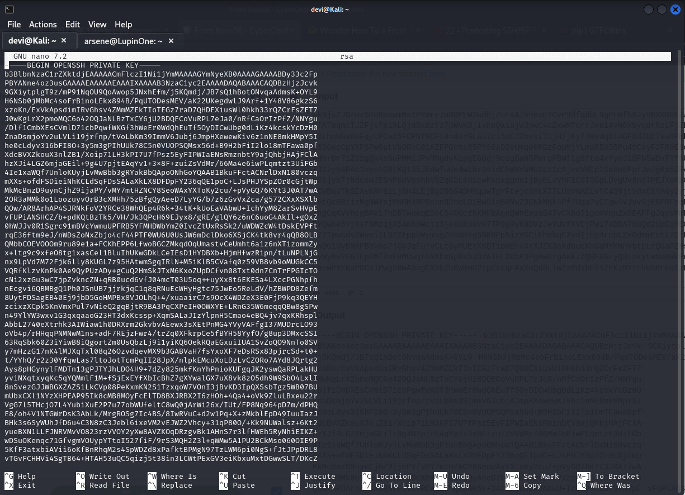
  </div>
<br>
  
  * the next step is to crack this private key with john to get the password, you can learn more about what is ssh and how to crack it from [here](https://null-byte.wonderhowto.com/how-to/crack-ssh-private-key-passwords-with-john-ripper-0302810/).
  
   <br>
  <div>
    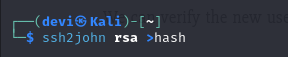
  </div>
<br>

* Remember the message we found on the website that tells us there is another hidden directory, Well it does not just end there it gave us anothe hints like a username which was `icex64` and a `fasttrack` which is a word list used for cracking passwords and brute-forcing, so we will use this wordlist for cracking the ssh password.
  
<br>

 ```bash
   john hash --wordlist=/usr/share/wordlists/fasttrack.txt  
 ```
 <br>

  <div>
    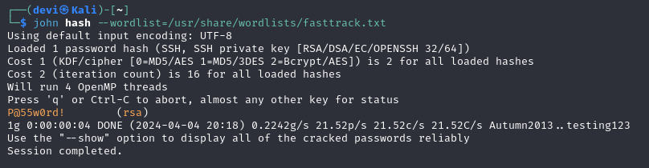
  </div>
<br>

* and the password for ssh key is `P@55w0rd!`, our next step is connect to the target machine via ssh but before connecting, first change the rsa file permssions to `400` or `600`.
```bash 
chmod 600 rsa
```
<br>

## Gaining Access 

* now we are ready to get into the machine via the ssh key and the username we found with it's password.
  
 <br>

  <div>
    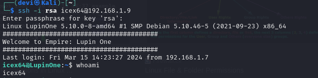
  </div>
<br>

* here we go we are in as the user icex64 let's get our first flag 
  
 <br>

  <div>
    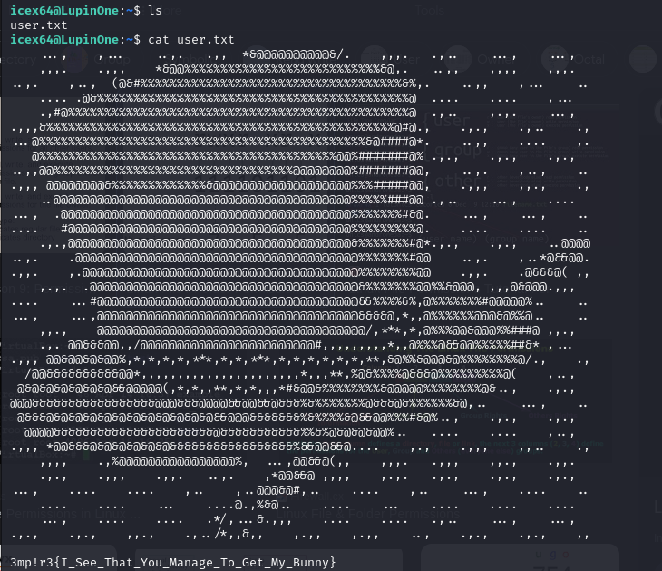
  </div>
<br>

## Privilege Escalation
* the next goal is to gain more privileges on the machine, and for that i started by runug `sudo -l ` to see what we could run as a sudo user with icex64 user.
  
 <br>

  <div>
    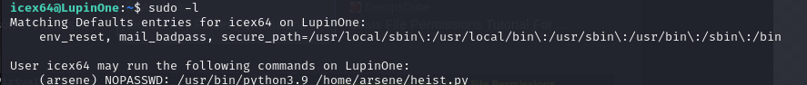
  </div>
<br>
  
  * just by runung this script i switched to arsene user. 
   
    <br>

  <div>
    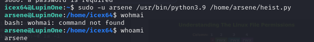
  </div>
<br>

* and after some searching in arsesne home folder i found another password, but i also did the same as before to see what can i run as a sudo user with arsene user, and i found that i can run pip as a root user.
  
     <br>

  <div>
    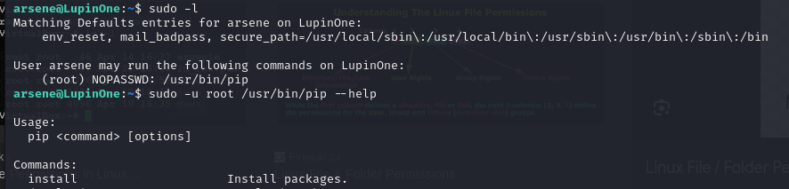
  </div>
<br>

* at this poing i used GTFobins to see how to switch to root user with pip and i used to following 
  ```bash
  TF=$(mktemp -d)
  echo "import os; os.execl('/bin/sh', 'sh', '-c', 'sh <$(tty) >$(tty) 2>$(tty)')">$TF/setup.py 
  sudo pip install $TF
  ```
   
     <br>

  <div>
    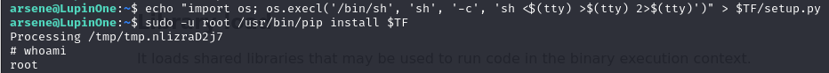
  </div>
<br>

* Here we go, we got the root user, let's read the final flag

  <br>

  <div>
    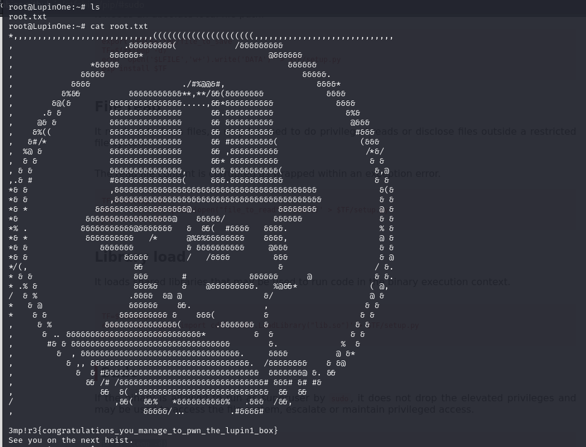
  </div>
<br>
  
 ### Thanks for reading <33
