API - Mass Assignment
---
Hello there i'm Abo Elnasr, we are tasked to make a report for API - Mass Assignment lab on Root Me.

---

#### 1. Analysis
We find that the lab is about an api testing and demonstration for the most api requests in web applications like signup,login and update..
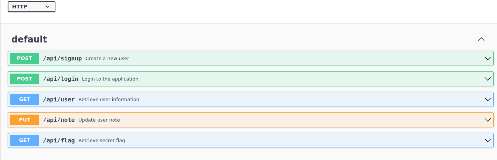

let's make our first request which is signing up a new account
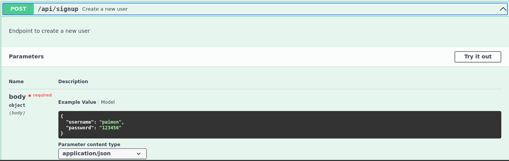
now let's login
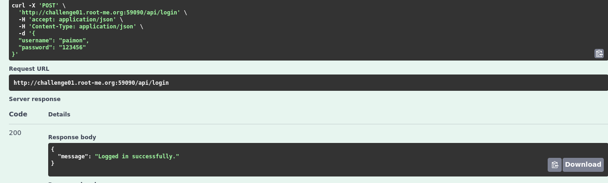

after login we will try to retrieve the information for the current user.
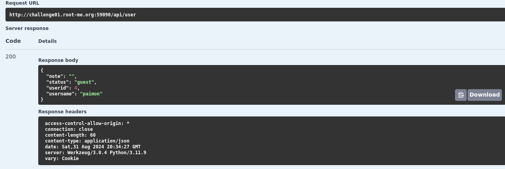
we see that:
1. username is Paimon
2. userid is 4
3. the status is a guest

the next request was to update the note field in the user information which was PUT request
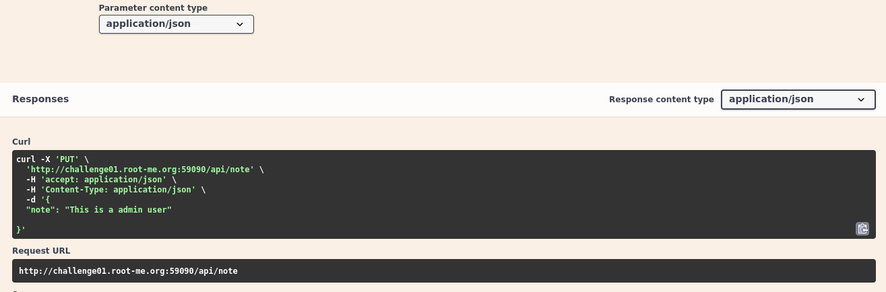

We will try to make a request to the flag end-point
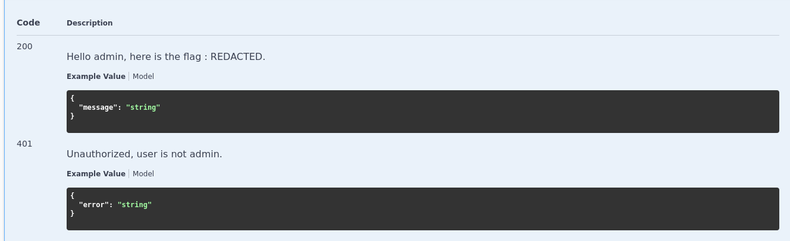
we see that we are not autheraized to see the flag 

---

#### 2. Exploitation
first we try to update the status from the PUT request for updating the notes on the user account
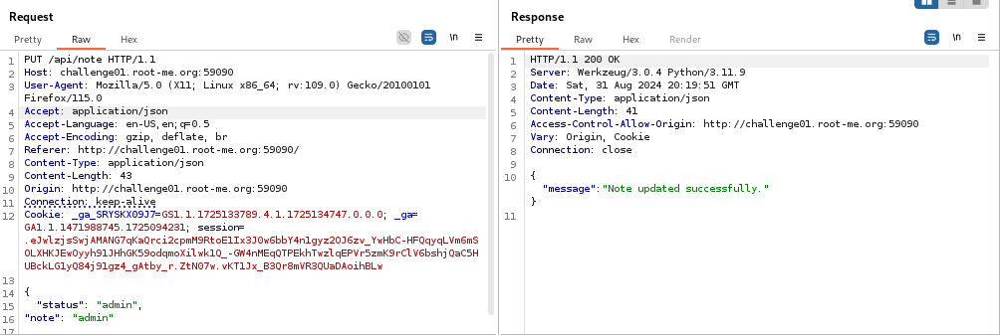
the request is sent successfuly, but the status didn't get updated so that didn't work sadly.
we will try to go around this by changing the request method 
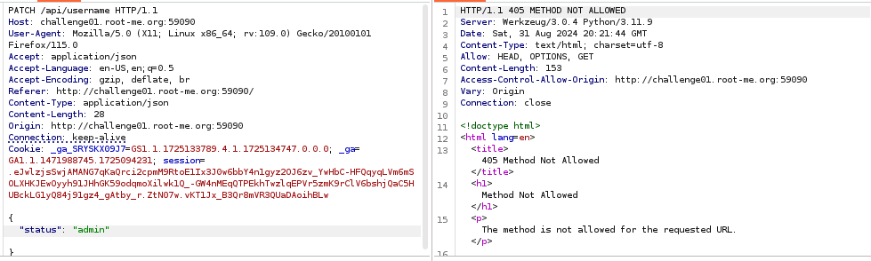

but also didn't work!
we then will try to lookup for another request that returns the user info 
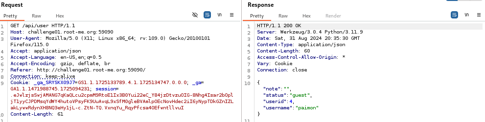
we will try to update the data insted of showing it, We do so by changing the GET request to PUT request 
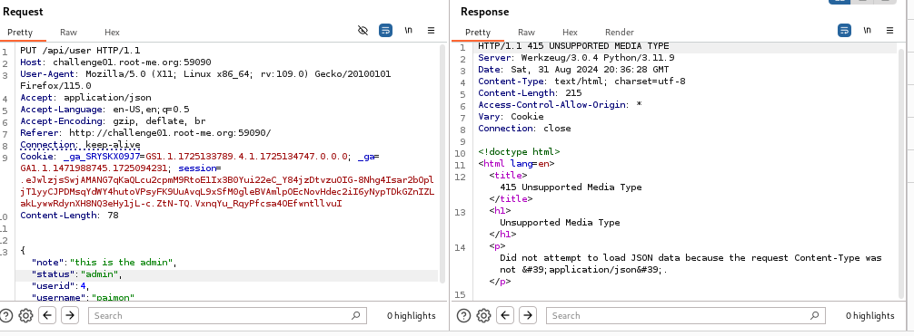

we get another error that the content-type should be in json, so we will change the content type in the http headers to Application/json
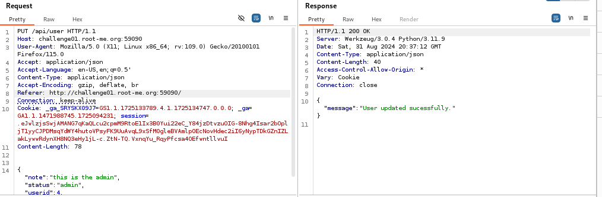
and we see that the user is updated successfuly 
now we will try to access the flag end-point
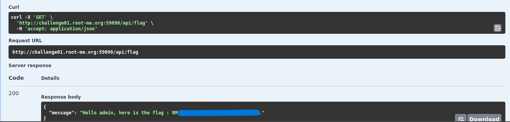

Soolved<3